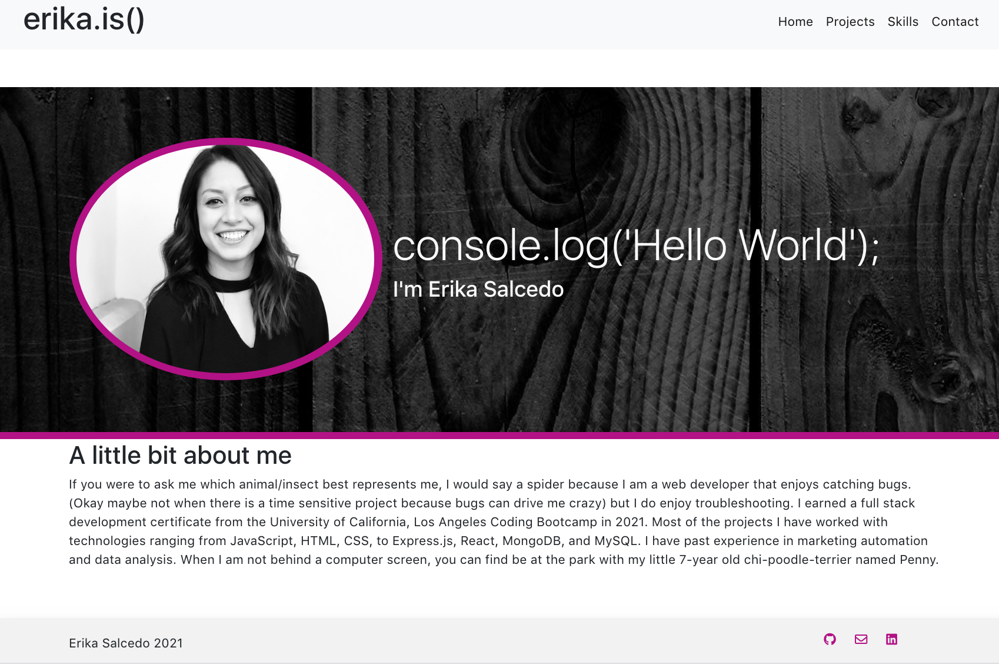
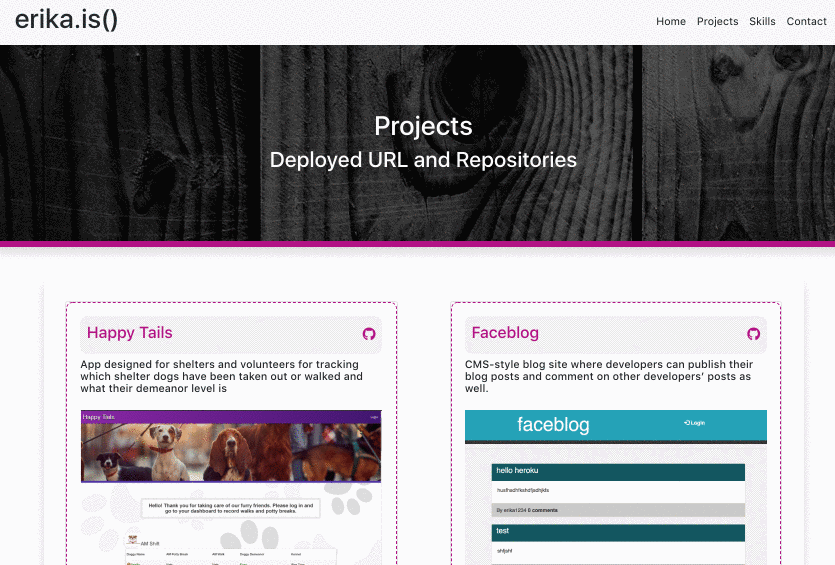
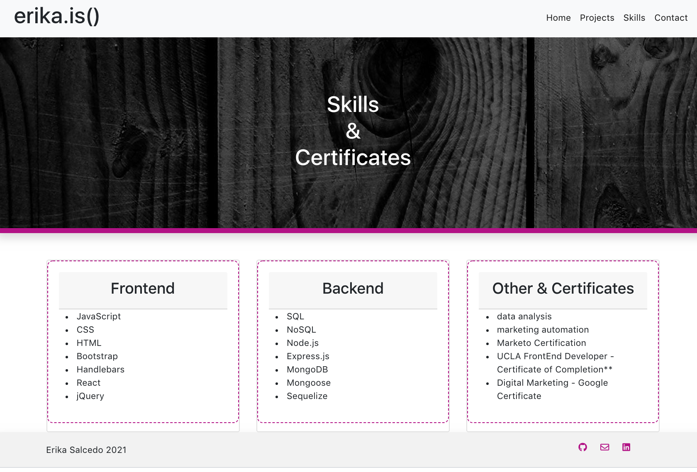
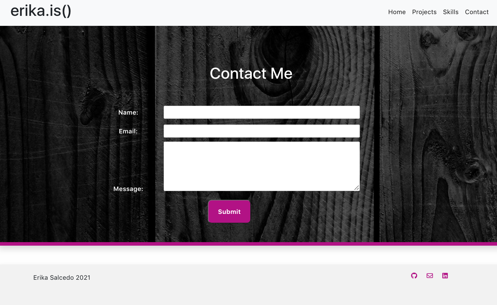

# My Portfolio
This is my personal portfolio that showcases deployed projects and github repositories I have worked on in the past, skills, and contacts information. 

# Home Section

# Projects Section

# Skills Section

# Contact Section

# Technologies Used
* React
* Javascript
* React Bootstrap
* Express.js
* Node.js

## Getting Started with Create React App

This project was bootstrapped with [Create React App](https://github.com/facebook/create-react-app).

## Available Scripts

In the project directory, you can run:

### `npm start`

Runs the app in the development mode.\
Open [http://localhost:3000](http://localhost:3000) to view it in the browser.

The page will reload if you make edits.\
You will also see any lint errors in the console.

### `npm run build`

Builds the app for production to the `build` folder.\
It correctly bundles React in production mode and optimizes the build for the best performance.

The build is minified and the filenames include the hashes.\
Your app is ready to be deployed!

See the section about [deployment](https://facebook.github.io/create-react-app/docs/deployment) for more information.

# Contact Information: 
* Github: es2013
* Email: erikasalcedo013@gmail.com

# Deployed Links
* Repo: [Repo](https://https://github.com/es2013/erikasalcedo_)
* Deployed Link: [Link](https://https://github.com/es2013/erikasalcedo_)
